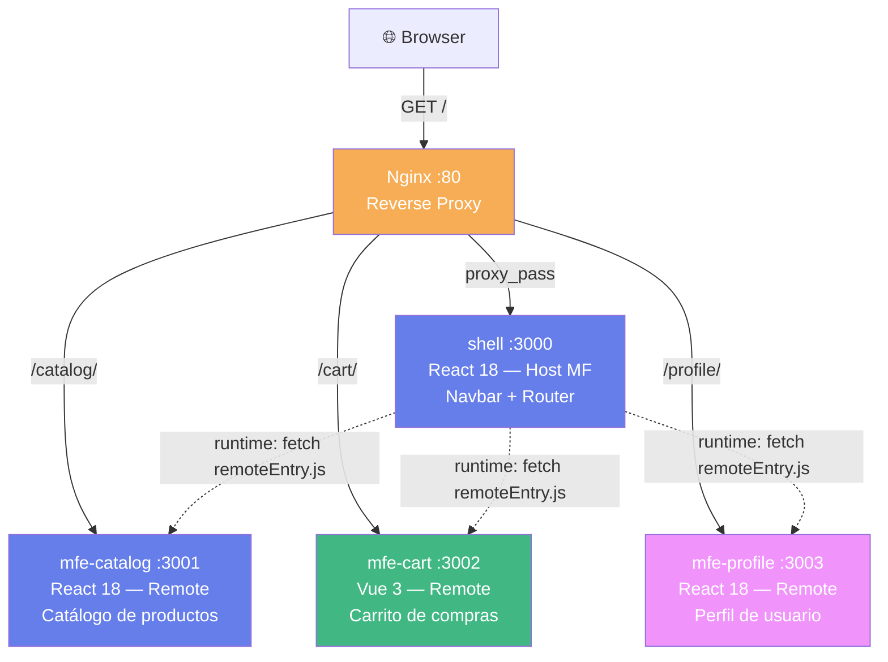
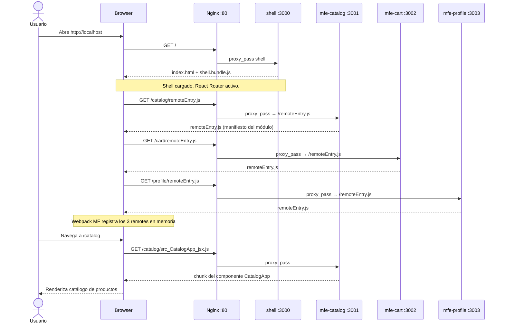
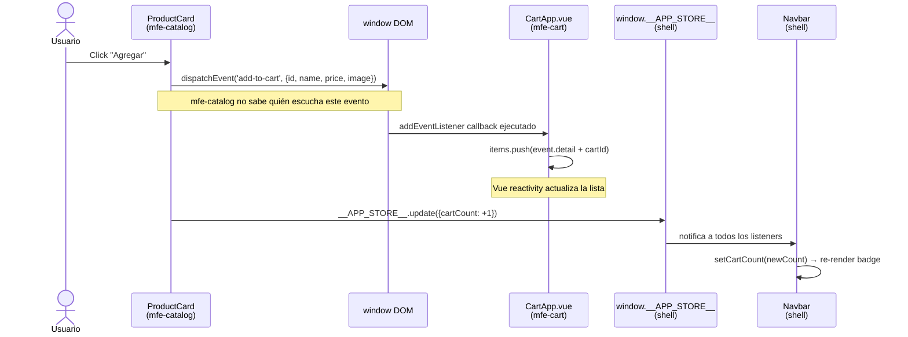
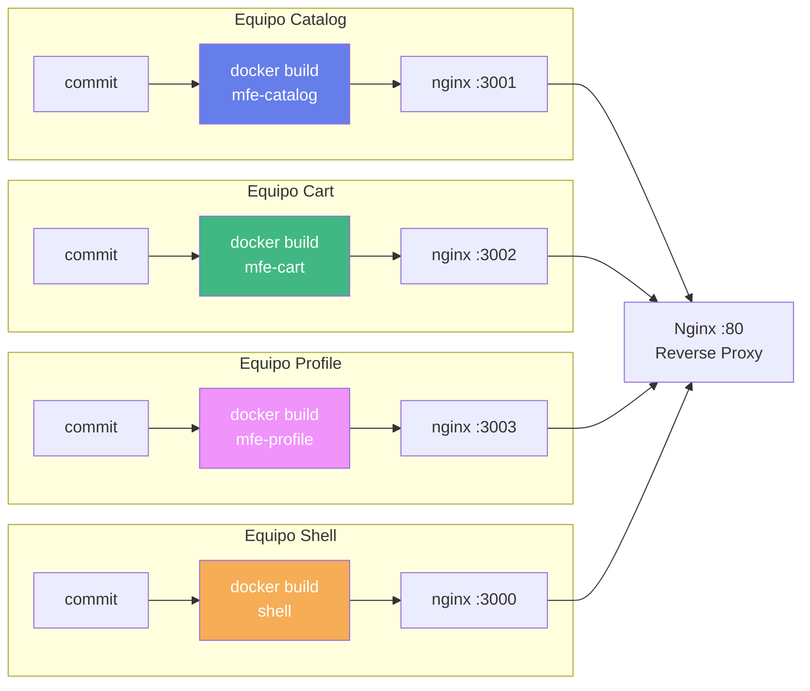
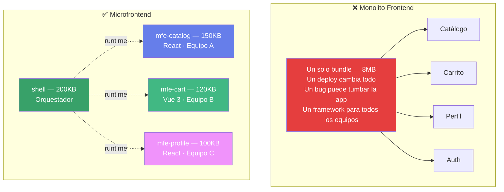
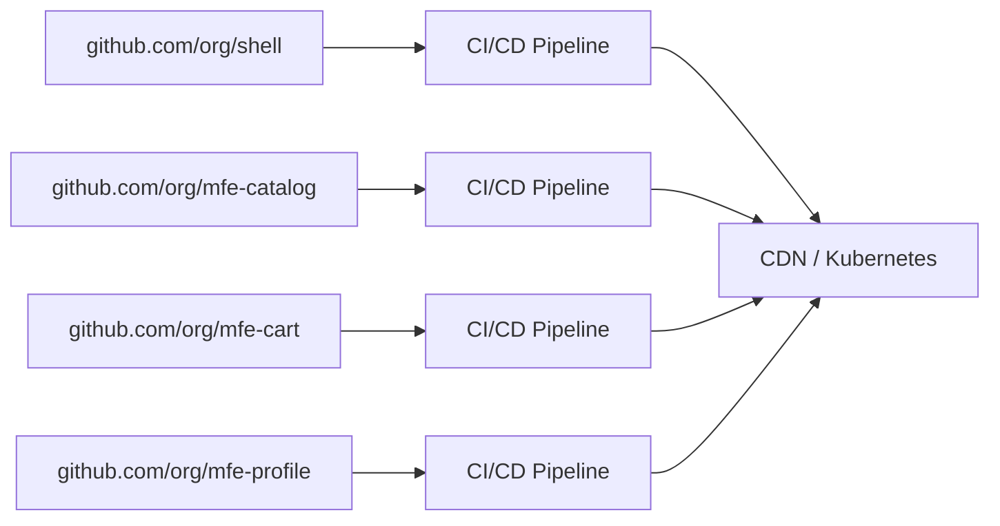

# Microfrontends E-Commerce

Ejemplo didáctico para la **Especialización en Microservicios** — módulo de Microfrontends.

Demuestra los **tres conceptos fundamentales** de la arquitectura microfrontend en un caso de estudio e-commerce funcional con código real y ejecutable.

---

## Inicio rápido

**Con Docker (recomendado):**
```bash
git clone <repo-url>
cd microfrontends-ecommerce
docker-compose up --build
# Abrir http://localhost
```

**Sin Docker — modo desarrollo:**
```bash
# Abrir 4 terminales y ejecutar cada uno en su directorio:
cd mfe-catalog && npm install && npm start   # :3001
cd mfe-cart    && npm install && npm start   # :3002
cd mfe-profile && npm install && npm start   # :3003
cd shell       && npm install && npm start   # :3000 → abrir este
```

---

## Concepto 1: Integración en Runtime (Module Federation)

Webpack Module Federation permite que el shell descargue código de otros proyectos **en tiempo de ejecución**, no en tiempo de compilación. El bundle del shell NO contiene código de los MFEs.

### Diagrama 1 — Arquitectura general



**Dónde verlo en el código:**
- `shell/webpack.config.js` — `remotes: { catalog: 'catalog@...' }` (host consume remotes)
- `mfe-catalog/webpack.config.js` — `exposes: { './CatalogApp': './src/CatalogApp' }` (remote expone módulos)
- `shell/src/App.jsx` — `React.lazy(() => import('catalog/CatalogApp'))` (carga en runtime)
- `nginx/nginx.conf` — reglas de proxy inverso

### Diagrama 2 — Flujo de carga en runtime



**Dónde verlo:**
- En DevTools → Network, filtrar `remoteEntry.js` — verás 3 peticiones a distintos orígenes
- `shell/src/App.jsx` línea 10-11: los `React.lazy` disparan el fetch al navegar
- `shell/src/remotes/CartWrapper.jsx` línea 12: `import('cart/CartApp')` descarga el módulo Vue

---

## Concepto 2: Comunicación entre MFEs

Los MFEs **no se importan entre sí**. Se comunican mediante dos patrones desacoplados.

### Diagrama 3 — Flujo add-to-cart



**Dónde verlo:**
- **Patrón A — Custom Events:** `mfe-catalog/src/components/ProductCard.jsx` → `window.dispatchEvent(new CustomEvent('add-to-cart', ...))`
- **Escucha sin import:** `mfe-cart/src/CartApp.vue` → `mounted() { window.addEventListener('add-to-cart', ...) }`
- **Patrón B — Shared State:** `shell/src/bootstrap.jsx` → definición de `window.__APP_STORE__`
- **Suscripción reactiva:** `shell/src/components/Navbar.jsx` → `window.__APP_STORE__.subscribe(...)`

| | Custom Events | Shared State |
|---|---|---|
| Acoplamiento | Cero — solo comparten el nombre del evento | Bajo — contrato del store object |
| Uso ideal | MFE → MFE (catalog → cart) | MFE → Shell (cart badge en navbar) |
| Dirección | Unidireccional broadcast | Bidireccional |

---

## Concepto 3: Despliegue Independiente

Cada MFE tiene su propio `Dockerfile` multi-stage. Se pueden reconstruir sin tocar los demás.

### Diagrama 4 — Pipelines independientes



**Comando clave — reconstruir solo el carrito:**
```bash
docker-compose up --build mfe-cart
# Solo mfe-cart se reconstruye. Shell, catalog y profile no se tocan.
```

**Dónde verlo:**
- `mfe-cart/Dockerfile` — Dockerfile independiente del resto
- `docker-compose.yml` — cada servicio con su propio `build:` context
- `shell/Dockerfile` — build args `CATALOG_URL`, `CART_URL`, `PROFILE_URL` para URLs de producción

---

## Monolito Frontend vs Microfrontend

### Diagrama 5 — Por qué importa la separación



---

## Estructura del repositorio

```
microfrontends-ecommerce/
├── shell/                          # Host MF — React 18
│   ├── src/index.js                # ← async import('./bootstrap') OBLIGATORIO en MF
│   ├── src/bootstrap.jsx           # ← inicializa window.__APP_STORE__
│   ├── src/App.jsx                 # ← React Router + React.lazy para remotes
│   ├── src/components/Navbar.jsx   # ← badge reactivo via shared store
│   ├── src/remotes/CartWrapper.jsx # ← monta Vue app dentro de React
│   └── webpack.config.js           # ← ModuleFederationPlugin HOST
│
├── mfe-catalog/                    # Remote MF — React 18
│   ├── src/CatalogApp.jsx          # ← componente expuesto via remoteEntry.js
│   ├── src/components/ProductCard.jsx # ← dispara CustomEvent 'add-to-cart'
│   └── webpack.config.js           # ← exposes: { './CatalogApp': ... }
│
├── mfe-cart/                       # Remote MF — Vue 3 ← framework distinto
│   ├── src/CartApp.vue             # ← escucha 'add-to-cart' en mounted()
│   ├── src/mount.js                # ← función mount/unmount para bridge React-Vue
│   └── webpack.config.js           # ← exposes: { './CartApp': './src/mount' }
│
├── mfe-profile/                    # Remote MF — React 18
│   ├── src/ProfileApp.jsx          # ← componente expuesto via remoteEntry.js
│   └── webpack.config.js           # ← exposes: { './ProfileApp': ... }
│
├── nginx/
│   └── nginx.conf                  # ← reverse proxy — simula API Gateway frontend
│
├── docker-compose.yml              # ← orquestación — deploy independiente por servicio
└── README.md
```

---

## Nota pedagógica: repo único vs repos separados

Este ejemplo usa **un solo repositorio** por simplicidad didáctica. En producción real, cada MFE viviría en su propio repositorio con su propio pipeline CI/CD:



Cada equipo tiene autonomía total: su repositorio, su pipeline, su ciclo de release, su elección de framework.

---

## Stack tecnológico

| Tecnología | Versión | Rol |
|---|---|---|
| React | 18 | Shell, mfe-catalog, mfe-profile |
| Vue | 3 | mfe-cart — demuestra independencia de framework |
| Webpack | 5 | Build + ModuleFederationPlugin |
| Docker | 24+ | Contenedores independientes por MFE |
| Nginx | 1.25 | Reverse proxy + servir assets estáticos |
| Node | 20 LTS | Runtime de build |
